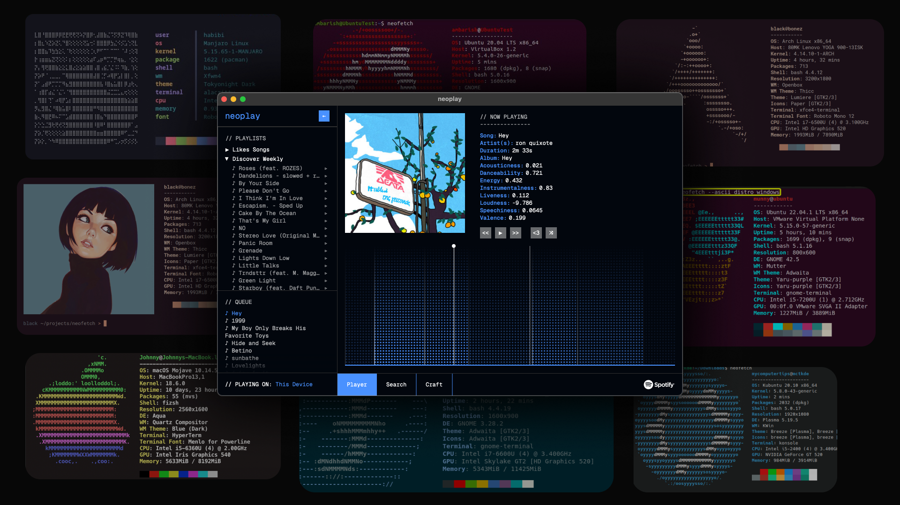

# neoplay


<a name="readme-top"></a>

<!-- TABLE OF CONTENTS -->
<details>
  <summary>Table of Contents</summary>
  <ol>
    <li>
      <a href="#about-the-project">About The Project</a>
      <ul>
        <li><a href="#tech-stack">Tech Stack</a></li>
      </ul>
    </li>
    <li> <a href="#features">Features</a></li>
    <li>
      <a href="#getting-started">Getting Started</a>
      <ul>
        <li><a href="#prerequisites">Prerequisites</a></li>
        <li><a href="#installation">Installation</a></li>
        <li><a href="#manual-setup">Manual Setup</a></li>
        <li><a href="#spotify-account-setup">Spotify Account Setup</a></li>
      </ul>
    </li>
    <li><a href="#contributing">Contributing</a></li>
    <li><a href="#license">License</a></li>
    <li><a href="#contact">Contact</a></li>
  </ol>
</details>

<!-- ABOUT THE PROJECT -->

## About The Project



neoplay is an open source, small weekend project aimed at creating a Spotify player with the following goals in mind.

1. Must be lightweight (Memory and CPU usage)
2. Must be themed for developers (Based on [Neofetch](https://github.com/dylanaraps/neofetch) and [VSCode](https://code.visualstudio.com/))
3. Must look cool

<p align="right">(<a href="#readme-top">back to top</a>)</p>

### Tech Stack

- Tauri V2
- SvelteKit
- Rust
- Spotify Web API
- Spotify Playback SDK

<!-- FEATURES -->

## Features

<!-- GETTING STARTED -->

- TODO

<p align="right">(<a href="#readme-top">back to top</a>)</p>

## Getting Started

To get a local copy of neoplay up and running follow these steps.

### Prerequisites

- Spotify Premium
- [Spotify Developer Account](https://developer.spotify.com/)
  - At the moment, you are required crete your own client ID and secret to log into neoplay. This might change in the future.

### Installation

The easiest way to start using neoplay is to download the latest executable binary for your OS from the [releases page](https://github.com/notnavindu/neoplay/releases).

After running the downloaded binary, follow the on-screen instructions.

### Manual Setup

1. Clone the repo
   ```sh
   git clone https://github.com/notnavindu/neoplay.git
   ```
2. Install the prerequisites ([From here](https://v2.tauri.app/start/prerequisites/))
3. Install NPM packages

   ```sh
   # npm
   npm install

   # pnpm
   pnpm install

   # yarn
   yarn
   ```

4. Start the server

   ```sh
    # npm
    npm tauri dev

    #pnpm
    pnpm tauri dev
   ```

5. Follow the on-screen instructions

<p align="right">(<a href="#readme-top">back to top</a>)</p>

### Spotify Account Setup

1. Log into [Spotify Developer Dashboard](https://developer.spotify.com/)
2. [Create an app](https://developer.spotify.com/documentation/web-api/tutorials/getting-started#create-an-app) from the dashboard and use the following settings:
   1. `App Name`: Neoplay
   2. `App Description`: Anything you like
   3. `Redirect URI (*Important)`: http://localhost:5177/callback
   4. `Which API/SDKs are you planning to use (*Important)`: Be sure to enable `Web API` and `Web Playback SDK`
3. Go to the `Settings` page in your newly created app.
4. You will see your `clientID` and `clientSecret`. These values will be required to log into neoplay.


<!-- CONTRIBUTING -->

## Contributing

Contributions are what make the open source community such an amazing place to learn, inspire, and create. Any contributions you make are **greatly appreciated**.

If you have a suggestion that would make this better, please fork the repo and create a pull request. You can also simply open an issue with the tag "enhancement".
Don't forget to give the project a star! Thanks again!

1. Fork the Project
2. Create your Feature Branch (`git checkout -b feature/AmazingFeature`)
3. Commit your Changes (`git commit -m 'Add some AmazingFeature'`)
4. Push to the Branch (`git push origin feature/AmazingFeature`)
5. Open a Pull Request

<p align="right">(<a href="#readme-top">back to top</a>)</p>

<!-- BENCHMARKS -->

## Benchmarks

TODO.

<p align="right">(<a href="#readme-top">back to top</a>)</p>

<!-- LICENSE -->

## License

Distributed under the GNU GPL v3 License. See `LICENSE` for more information.

<p align="right">(<a href="#readme-top">back to top</a>)</p>

<!-- CONTACT -->

## Contact

Navindu - [@notnavindu](https://twitter.com/notnavindu)

Project Link: [https://github.com/notnavindu/neoplay](https://github.com/notnavindu/neoplay)

<p align="right">(<a href="#readme-top">back to top</a>)</p>
